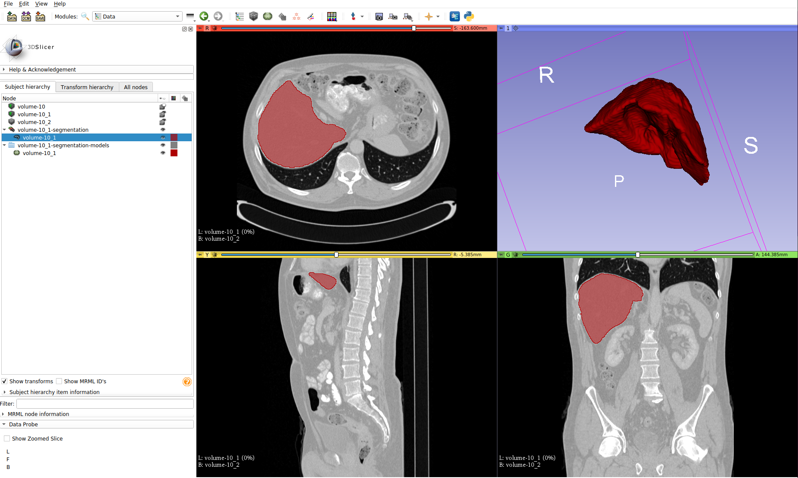

# Automatic liver segmentation in CT using deep learning
[](https://github.com/DAVFoundation/captain-n3m0/blob/master/LICENSE)
[](https://github.com/andreped/livermask/actions)

#### Pretrained U-Net model is automatically downloaded when running the inference script and can be used as you wish.



## Install

```
pip install git+https://github.com/andreped/livermask.git
```

As TensorFlow 2.4 only supports Python 3.6-3.8, so does livermask.

Program has been tested using Python 3.7 on Windows, macOS, and Ubuntu Linux 18.04.

## Usage:

```
livermask --input path-to-input --output path-to-output
```

|  command | description |
| ------------------- | ------------- |
| `--input`  | the full path to the input data. Could be nifti file or directory (if directory is provided as input) |
| `--output`  | the full path to the output data. Could be either output name or directory (if directory is provided as input)  |
| `--cpu`  | to disable the GPU (force computations on GPU only) |
| `--verbose`  | to enable verbose |

## DICOM/NIfTI format
Pipeline assumes input is in the NIfTI format, and output a binary volume in the same format (.nii).
DICOM can be converted to NIfTI using the CLI [dcm2niix](https://github.com/rordenlab/dcm2niix), as such:
```
dcm2niix -s y -m y -d 1 "path_to_CT_folder" "output_name"
```

Note that "-d 1" assumed that "path_to_CT_folder" is the folder just before the set of DICOM scans you want to import and convert. This can be removed if you want to convert multiple ones at the same time. It is possible to set "." for "output_name", which in theory should output a file with the same name as the DICOM folder, but that doesn't seem to happen...

## Troubleshooting
You might have issues downloading the model when using VPN. If any issues are observed, try to disable VPN and try again.

If the program struggles to install, attempt to install using:
```
pip install --force-reinstall --no-deps git+https://github.com/andreped/livermask.git
```

## Acknowledgements
The model was trained on the LITS dataset. The dataset is openly accessible and can be downloaded from [here](https://competitions.codalab.org). If this tool is used, please, consider citing the corresponding [LITS challenge dataset paper](https://arxiv.org/abs/1901.04056).

Disclaimer, I have no affiliation with the LITS challenge, the LITS dataset, or the challenge paper. I only wish to provide an open, free-to-use tool that people may find useful :)

------

Made with :heart: and python
